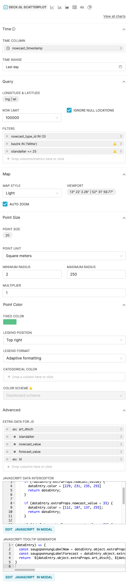

<!-- ALL-CONTRIBUTORS-BADGE:START - Do not remove or modify this section -->

[](#contributors-)

<!-- ALL-CONTRIBUTORS-BADGE:END -->

# QTrees Superset Frontend

In this repository you will find superset frontend customization description of the QTrees Dashboard.

## TODO (after you generated the repo)

- [ ] Review the content of the README.md and adjust to your liking
- [ ] Read the README.md till the end and adjust the content licensing,
      logos, etc (I know you stopped at tbd...)
- [ ] Adjust the file [.github/CODEOWNERS](./.github/CODEOWNERS)
- [ ] Adjust the files under [.github/ISSUE_TEMPLATE](./.github/ISSUE_TEMPLATE)
- [ ] If you use staging and main branches use this template for [.github/renovate.json](./.github/renovate.json)

```json
{
	"$schema": "https://docs.renovatebot.com/renovate-schema.json",
	"extends": ["github>technologiestiftung/renovate-config"],
	"baseBranches": ["staging"]
}
```

- [ ] Do you want to honor all kinds of contributions? Use [all-contributors](https://allcontributors.org/)

```bash
npx all-contributors-cli check
npx all-contributors-cli add ff6347 doc
```

You can use it on GitHub just by commenting on PRs and issues:

```plain
@all-contributors please add @ff6347 for infrastructure, tests and code
```
#

## Prerequisites 

Install the backend described here: https://github.com/technologiestiftung/qtrees-superset

## Installation

The QTrees dashboard uses a Deck.gl Scatterplot for "Baumkarte" that uses custom JS. 
This is the configuration:



In the **Advanced** section, the following settings are configured:

#### Extra data for JS
The columns that have been added are:
- `art_dtsch`
- `standalter`
- `nowcast_value`
- `forecast_value`
- `id`


#### JavaScript data interceptor
An interceptor has been added to make the colors of the displayed point a gradient 
related to the "saugspannung" rather than the default "random" color set. 
This is the snippet:

```JavaScript
(dataArray) => {
      return dataArray.map((dataEntry) => {
            if (!dataEntry.extraProps.nowcast_value) {
                  dataEntry.color = [229, 231, 235, 255]
                  return dataEntry;
            }

            if (dataEntry.extraProps.nowcast_value < 33) {
                  dataEntry.color = [112, 187, 137, 255];
                  return dataEntry;
            }

            if (dataEntry.extraProps.nowcast_value < 81) {
                  dataEntry.color = [224, 215, 126, 255];
                  return dataEntry;
            }

            dataEntry.color = [254, 172, 118, 255];
            return dataEntry;
      })
}
```

#### JavaScript tooltip generator
The tooltip has been adjusted to fill it with more useful information, 
such as the tree species, its age and its suction tension. 
This is the snippet:

```JavaScript
(dataEntry) => {
      const saugspannungLabelNow = dataEntry.object.extraProps.nowcast_value ? `${dataEntry.object.extraProps.nowcast_value} kPa` : '';
      const saugspannungLabelForecast = dataEntry.object.extraProps.forecast_value ? `${dataEntry.object.extraProps.forecast_value} kPa` : '';
      return `${dataEntry.object.extraProps.art_dtsch}, ${dataEntry.object.extraProps.standalter} Jahre <br> Saugspannung (heute): ${saugspannungLabelNow} <br> Sauspannung (14 Tage): ${saugspannungLabelForecast} <br> Id: ${dataEntry.object.extraProps.id}`;
}

```

## Contributing

Before you create a pull request, write an issue, so we can discuss your changes.

## Contributors

Thanks goes to these wonderful people ([emoji key](https://allcontributors.org/docs/en/emoji-key)):

<!-- ALL-CONTRIBUTORS-LIST:START - Do not remove or modify this section -->
<!-- prettier-ignore-start -->
<!-- markdownlint-disable -->
<table>
  <tr>
  </tr>
</table>

<!-- markdownlint-restore -->
<!-- prettier-ignore-end -->

<!-- ALL-CONTRIBUTORS-LIST:END -->

This project follows the [all-contributors](https://github.com/all-contributors/all-contributors) specification. Contributions of any kind welcome!

## Content Licensing

Texts and content available as [CC BY](https://creativecommons.org/licenses/by/3.0/de/).

Illustrations by {MARIA_MUSTERFRAU}, all rights reserved.

## Credits

<table>
  <tr>
    <td>
      Made by <a href="https://citylab-berlin.org/de/start/">
        <br />
        <br />
        
      </a>
    </td>
    <td>
      A project by <a href="https://www.technologiestiftung-berlin.de/">
        <br />
        <br />
        
      </a>
    </td>
    <td>
      Supported by <a href="https://www.berlin.de/rbmskzl/">
        <br />
        <br />
        
      </a>
    </td>
  </tr>
</table>

## Related Projects
[QTrees Superset Backend](https://github.com/technologiestiftung/qtrees-superset)